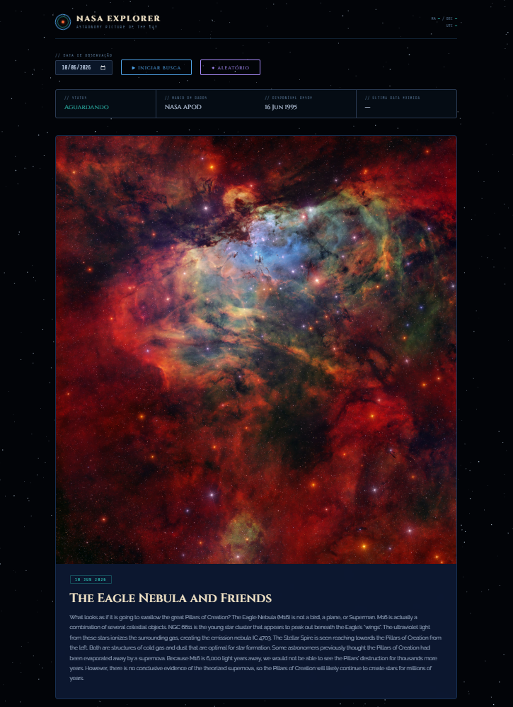

# NASA Space Explorer



Uma aplicação web interativa que consome a API pública da NASA APOD (Astronomy Picture of the Day) para exibir imagens astronômicas incríveis diretamente da NASA.

O projeto foi desenvolvido como entrega final do Bootcamp, aplicando conceitos de integração com API pública, banco de dados em nuvem, testes automatizados, versionamento com Git/GitHub, trabalho em equipe com Pull Requests e deploy.

---

## Integrantes

| Nome | GitHub |
|------|--------|
| Lanna Soares | [@lannacsoares](https://github.com/lannacsoares) |
| Geovanna Benedito | [@geovannadsb](https://github.com/geovannadsb) |
| Sophia Melo | [@sophia473](https://github.com/sophia473) |

---

## Demonstração

Acesse a aplicação online:
https://lannacsoares.github.io/nasa_space_explorer/

---

## Funcionalidades

Consumo da API oficial da NASA APOD
Exibição da imagem astronômica do dia
Suporte para imagens e vídeos
Pesquisa por data específica
Seleção aleatória de imagens históricas
Interface futurista com animação espacial
Feedback visual de carregamento
Tratamento de erros de conexão
Design responsivo
Teste de integração com API
Histórico de buscas salvo no banco de dados

---

## Tecnologias Utilizadas

### Front-end
- HTML5
- CSS3
- JavaScript (ES Modules)

### Banco de Dados
- Supabase (PostgreSQL)

### Testes
- Jest

### Versionamento
- Git
- GitHub

### Deploy
- GitHub Pages

---

## Como rodar localmente

1. Clone o repositório:
```bash
git clone https://github.com/lannacsoares/nasa_space_explorer
```

2. Entre na pasta:
```bash
cd nasa_space_explorer
```

3. Instale as dependências:
```bash
npm install
```

4. Abra o arquivo `index.html` no navegador ou use a extensão **Live Server** no VS Code.

---

## Estrutura do Projeto

```txt
nasa_space_explorer/
│
├── index.html
├── style.css
├── main.js
├── api.js
├── ui.js
├── utils.js
├── starfield.js
├── supabase.js
│
├── api.test.js
│
├── package.json
├── package-lock.json
├── vercel.json
├── preview.png
│
└── README.md
```
